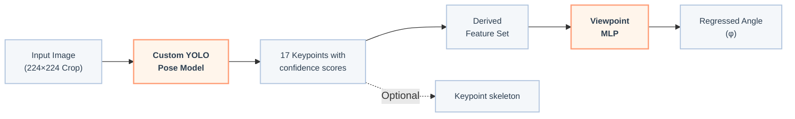

# Viewpoint Estimation for Animal Re-Identification on Edge Devices
This repository contains the code and models to accompany my thesis at the Max Planck Institute for Intelligent Systems and University of Tübingen
* **Species:** Optimized for Equids (specifically Zebras)
* **Input Dimensions:** $224 \times 224$ bounding box crops
* **Downstream Integrations:** Embedded within [`RAPID`](https://github.com/robot-perception-group/RAPID-animal-reidentification) and the [`Behaviors Inference Framework`](https://github.com/robot-perception-group/Animal-Behaviour-Inference-Framework)
---

See the demo of the viewpoint estimator [on YouTube](https://youtu.be/7CFVS-LiWfc)

https://github.com/user-attachments/assets/3ff355d4-a38e-477b-acef-3ea29a74ad63

---

## Repository Architecture

This repository is organized into two separate branches:

* **`master`**: Contains the full pipeline and model training scripts from my thesis. Use this branch to experiment, evaluate ablation configurations or train custom models.
* **`module`**: A lightweight, production-ready release containing only the core standalone estimator. Switch to this branch for direct, dependencies-minimized deployment and framework integration.

Binary model weights can be found in the release package for this thesis.

the `demo/` directory includes sampled images for two zebras including 8 different viewpoints from the [`ZebraStereoID`](https://darus.uni-stuttgart.de/dataset.xhtml?persistentId=doi:10.18419/DARUS-5957) dataset. 
